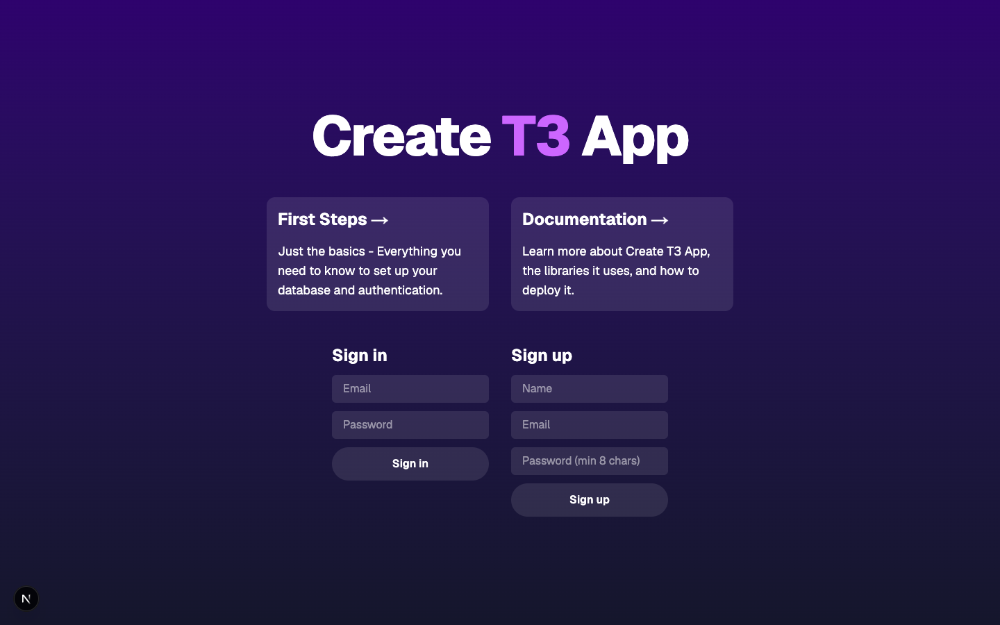
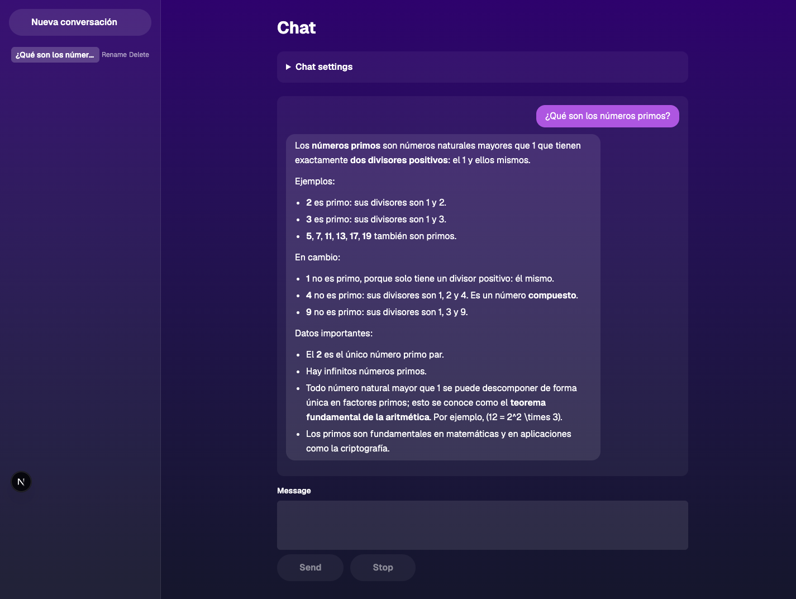
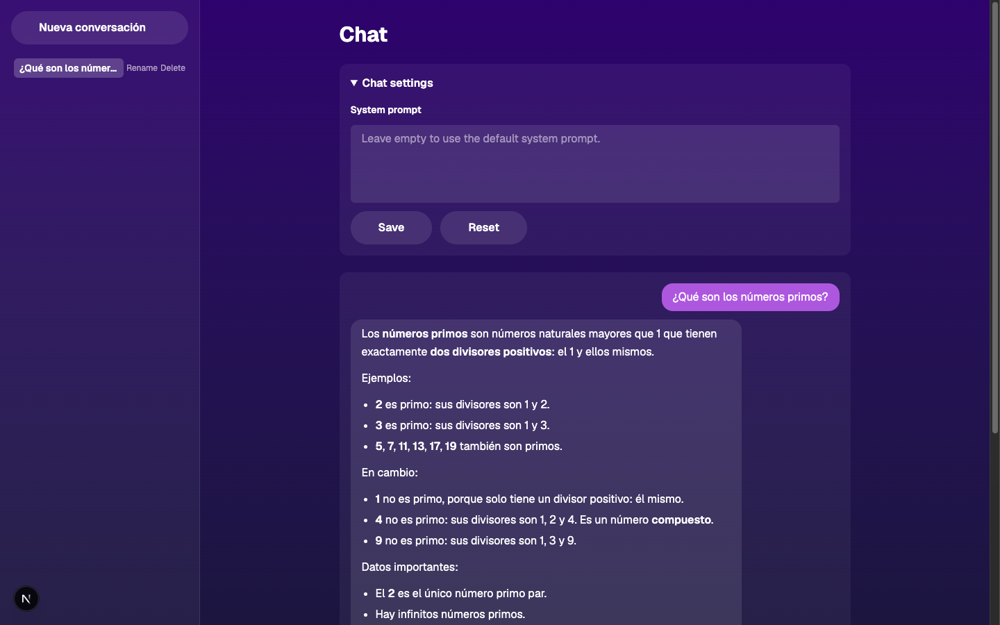

# Desarrollo de Software con IA — Workshop Chatbot

An authenticated, streaming chatbot built on DeepSeek. It is the live demo for the "Desarrollo de Software con IA" workshop: the application is real, and the `issues/`, `prompts/` and `tech-stack/` directories are the material used to build it on stage with AI-assisted workflows.

Built with the T3 stack — Next.js 15 (App Router), React 19, Better Auth, Drizzle ORM on Postgres, Tailwind CSS v4, Biome, and Bun.

## Screenshots

Email and password authentication, with sign-in and sign-up side by side.



A conversation. Replies stream in token by token and render as markdown, with a sidebar listing past conversations that can be renamed or deleted.



Each conversation can override the system prompt. Leaving it empty falls back to the default.



## Features

- **Streaming replies** over a plain `text/plain` response body, with a Stop button that aborts the upstream request rather than just hiding the output.
- **Markdown rendering** of assistant replies, including tables, lists and fenced code. Raw HTML from the model stays inert text.
- **Persistent conversations.** Messages are stored in Postgres and every query is scoped to the signed-in user.
- **Per-conversation system prompt**, editable from the UI.
- **Per-user rate limiting**, a sliding window keyed by user rather than by conversation.
- **Email and password auth** via Better Auth, with server actions rather than client-side auth calls.

## Requirements

- [Bun](https://bun.sh)
- Docker, for Postgres
- A DeepSeek API key from [platform.deepseek.com](https://platform.deepseek.com/api_keys)

## Getting started

```bash
bun install
cp .env.example .env          # then fill in DEEPSEEK_API_KEY
docker compose up -d          # Postgres 17 on the port below
bun run db:push               # create the tables
bun dev                       # http://localhost:3000
```

Open the app, create an account with the sign-up form, and start a conversation.

> **Check the port before you copy `.env`.** `docker-compose.yml` publishes Postgres on `${POSTGRES_PORT:-5434}`, but `.env.example` still points at `5464`. If they disagree you get `ECONNREFUSED`. Set `POSTGRES_PORT` explicitly, or edit `DATABASE_URL` to match the port the container actually published.

### Environment variables

`src/env.js` is the single source of truth, validated with zod at build time. Add new variables there **and** in `.env.example`.

| Variable | Required | Default |
| --- | --- | --- |
| `DATABASE_URL` | yes | — |
| `DEEPSEEK_API_KEY` | yes | — |
| `BETTER_AUTH_SECRET` | in production only | — |
| `DEEPSEEK_BASE_URL` | no | `https://api.deepseek.com/anthropic` |
| `DEEPSEEK_MODEL` | no | `deepseek-flash` |
| `CHAT_RATE_LIMIT_PER_MINUTE` | no | `20` |

Set `SKIP_ENV_VALIDATION=1` to bypass validation, which Docker builds need. Note that it skips zod entirely, so defaults above are not applied at runtime when it is set.

## Scripts

```bash
bun dev              # dev server with Turbo
bun run build        # production build
bun run preview      # build, then start
bun run typecheck    # tsc --noEmit
bun run check        # Biome lint and format check
bun run check:write  # Biome auto-fix

bun test                                    # whole suite
bun test src/server/ai                      # one directory
bun test src/server/ai/rate-limit.test.ts   # one file
bun test -t "window expires"                # one test by name

bun run db:push      # push schema (development)
bun run db:generate  # generate migration SQL
bun run db:migrate   # apply migrations
bun run db:studio    # Drizzle Studio
```

### Tests

Tests under `src/server/ai/` and `src/app/` are pure and need nothing running. `src/server/chat/conversations.test.ts` runs against a **real Postgres** and asserts that one user cannot read, rename or delete another user's conversations. With no database up it fails with `ECONNREFUSED`, which is an environment problem rather than a regression.

## Architecture

The chat endpoint is `POST /api/chat`, running on the Node runtime because Better Auth and the Postgres driver both need Node APIs.

| Status | Meaning |
| --- | --- |
| 200 | Streamed `text/plain`, with the conversation id in `X-Conversation-Id` |
| 400 | Invalid body, oversized body, or unparseable JSON |
| 401 | Not signed in |
| 404 | Conversation unknown, or owned by someone else |
| 429 | Rate limited, with `Retry-After` |
| 502 | Upstream provider failed, or produced no first token in time |

The order of operations is deliberate. The session is checked first, then the rate limit, and only then is the body read and the conversation resolved, so an anonymous or over-quota request never spends provider tokens. The handler drains events up to the first text delta *before* returning a response, because once a 200 is on the wire the status can no longer change, and that window is the only place an upstream failure can still surface as a 502.

`src/server/chat/conversations.ts` is the only module that touches the `conversation` and `message` tables. Every function takes `userId` first and filters by it in the query, so isolation between users lives in one file.

Deeper notes live in [`CLAUDE.md`](CLAUDE.md) and the write-ups in [`tech-stack/`](tech-stack/).

## Workshop material

These directories are content rather than application code:

- `issues/` — the markdown source of truth for the parent issue, three epics and their sub-issues. GitHub issues are published from here.
- `prompts/` — ready-to-paste prompts in Spanish, one per methodology, plus the publishing script.
- `tech-stack/` and `mvp-requirements.md` — architecture write-ups, Mermaid diagrams and a risk register.

The workshop covers three progressive methodologies: issue-driven, BDD, and epic-driven with agent teams.
