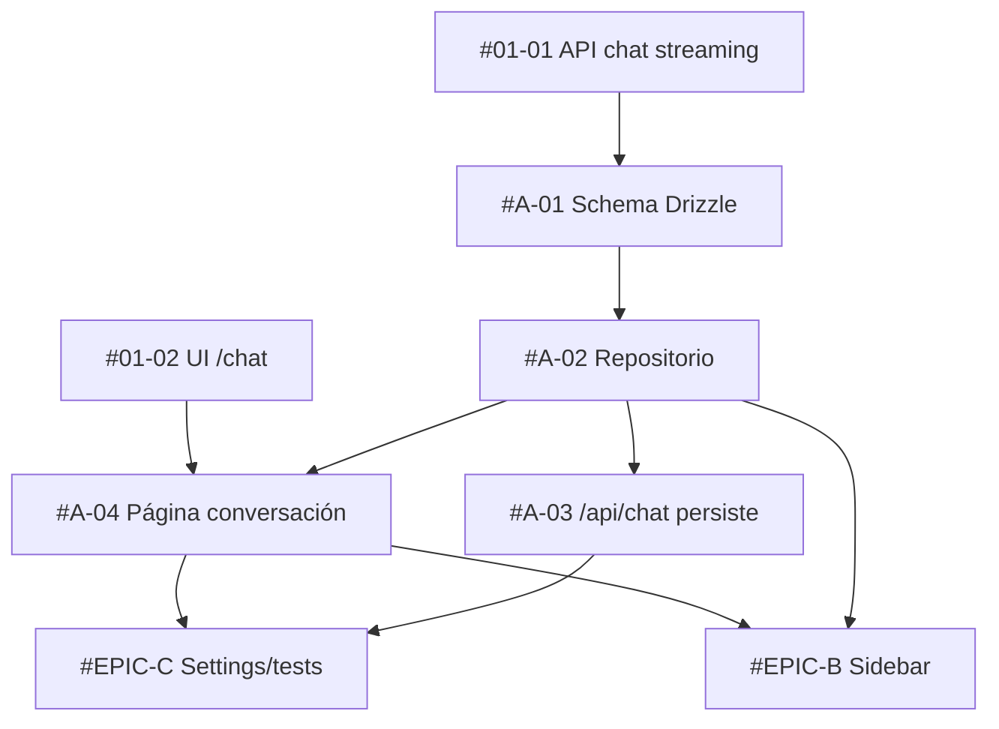

# [EPIC] Persistencia de conversaciones y mensajes

## 📋 Summary
Guardar cada conversación del chatbot y sus mensajes en Postgres, ligados al usuario autenticado, para que `/chat/[conversationId]` pueda recuperar el historial y el resto de epics (sidebar, system prompt) tengan datos sobre los que trabajar.

## 🎯 Problem Statement
Tras #01-01 y #01-02 el chat funciona pero es efímero: el historial vive solo en el estado de React y desaparece al recargar. Sin persistencia no hay lista de conversaciones, ni renombrar/borrar, ni system prompt por conversación. Este epic es el prerrequisito de #EPIC-B y #EPIC-C.

## 💡 Proposed Solution
Añadir las tablas `conversation` y `message` con Drizzle (helper `createTable` existente), un repositorio user-scoped en `src/server/chat/conversations.ts`, hacer que `POST /api/chat` cree/continúe conversaciones y persista ambos mensajes devolviendo `X-Conversation-Id`, y una página `/chat/[conversationId]` que carga el historial.

## 🔧 Task Breakdown & Assignments

### Sub-Issues Overview
| Issue | Title                                                        | Agent/Assignee       | Story Points | Priority | Tier | Dependencies    | Completed |
| ----- | ------------------------------------------------------------ | -------------------- | ------------ | -------- | ---- | --------------- | --------- |
| #A-01 | Schema Drizzle conversation/message + fix tablesFilter       | @database-optimizer  | 3            | P0       | 0    | #01-01          | [ ]       |
| #A-02 | Repositorio de conversaciones user-scoped + setup bun test   | @backend-architect   | 5            | P0       | 1    | #A-01           | [ ]       |
| #A-03 | /api/chat persiste mensajes y devuelve X-Conversation-Id     | @backend-architect   | 5            | P0       | 2    | #A-02           | [ ]       |
| #A-04 | Página /chat/[conversationId] con historial                  | @frontend-developer  | 3            | P0       | 2    | #A-02, #01-02   | [ ]       |

> **📝 Status Update Instructions:**
> Cuando un sub-issue se complete, edita esta descripción y marca `[x]` en la columna "Completed".
> **NO** publiques actualizaciones de estado en comentarios. Toda la trazabilidad vive en esta tabla.

**Total Story Points**: 16

## Sub-issues
- [ ] #A-01
- [ ] #A-02
- [ ] #A-03
- [ ] #A-04

### Agent Assignments & Specializations
| Agent               | Specialization            | Assigned Tasks | Total Points | Skills/Tooling          |
| ------------------- | ------------------------- | -------------- | ------------ | ----------------------- |
| @database-optimizer | Schema y migraciones      | #A-01          | 3            | -                       |
| @backend-architect  | API y capa de datos       | #A-02, #A-03   | 10           | claude-api              |
| @frontend-developer | UI Next.js / React 19     | #A-04          | 3            | component-reuse-first   |

### Claude Code Skills & Tooling
**Existing Skills to Use:**
- `claude-api` — referencia del SDK `@anthropic-ai/sdk` (`messages.stream()`, `finalMessage()`) al persistir la respuesta del asistente en #A-03.
- `component-reuse-first` — #A-04 debe reutilizar `ChatPanel` y `MessageBubble` de #01-02 en vez de crear componentes nuevos.

**Recommended New Skills:**
- Ninguna. El dominio (Drizzle + Route Handlers) está cubierto por los agentes existentes.

### Dependency Graph

### Tiers de ejecución paralela
- **Tier 0**: #A-01 (solo; modifica schema y config compartidos)
- **Tier 1**: #A-02
- **Tier 2 (paralelo)**: #A-03 y #A-04 — archivos disjuntos gracias al contrato fijo de `POST /api/chat` (header `X-Conversation-Id`, body `conversationId?`)

### Integration Points
- **#A-01 (@database-optimizer) → #A-02 (@backend-architect)**: tablas `conversation` y `message` exportadas desde `src/server/db/schema.ts` con sus `relations`.
- **#A-02 (@backend-architect) → #A-03 y #A-04**: API del repositorio `src/server/chat/conversations.ts` (todas las funciones reciben `userId` primero).
- **#A-03 (@backend-architect) → #A-04 (@frontend-developer)**: header `X-Conversation-Id` en la respuesta de `POST /api/chat`; el cliente hace `router.replace` cuando recibe un id nuevo.
- **#A-02 → #EPIC-B**: `listConversations`, `renameConversation`, `deleteConversation` consumidos por los server actions del sidebar.
- **#A-03 → #EPIC-C**: la ruta ya lee `conversation.systemPrompt`; #C-02 solo añade la UI y el action.

## ✅ Acceptance Criteria

- [ ] Los cuatro sub-issues están completados y mergeados en `main`
- [ ] `bun run db:push` crea `pg-drizzle_conversation` y `pg-drizzle_message` sin tocar tablas ajenas
- [ ] Un usuario A no puede leer, continuar ni listar conversaciones del usuario B (404 en la API, vacío en el repo)
- [ ] Recargar `/chat/<id>` muestra el historial completo en orden cronológico
- [ ] `bun test`, `bun run typecheck` y `bun run check` en verde
- [ ] `CLAUDE.md` actualizado (gotcha de `tablesFilter` resuelto, sección `src/server/chat/`)

## 📎 Additional Context

### Related Issues
- #EPIC-PARENT — Chatbot con DeepSeek (epic global)
- #01-01 — API de chat streaming (prerrequisito)
- #01-02 — Página `/chat` (prerrequisito de #A-04)
- #EPIC-B, #EPIC-C — dependen de este epic

### References
- Plan técnico: `prompts/03-epic-driven.md`
- Drizzle `pgTableCreator`: https://orm.drizzle.team/docs/goodies#multi-project-schema
- Next 15 `params` asíncronos: https://nextjs.org/docs/app/api-reference/file-conventions/page#params-optional

### Technical Notes
- **Postgres compartido**: todos los worktrees apuntan a la misma base (`localhost:5434`). El `db:push` de #A-01 afecta a todos. Por eso este epic (P0) debe estar **mergeado en `main`** antes de arrancar #EPIC-B: el Tier 0 de B depende de #A-02 en `main`, no en una rama hermana.
- Cada worktree necesita su propio `.env` y `node_modules` (ambos ignorados por git).

## 🏷️ Labels
`epic`, `P0`, `backend`, `database`

## 📅 Timeline
- **Start**: Demo Epic-Driven (workshop)
- **Target Completion**: Tier 0 + Tier 1 en vivo; Tier 2 tras el workshop
- **Estimated Duration**: 16 story points

## 👥 Team
- **Owner**: @ronnycoding
- **Contributors**: @database-optimizer, @backend-architect, @frontend-developer
- **Reviewers**: @code-reviewer, @security-auditor
