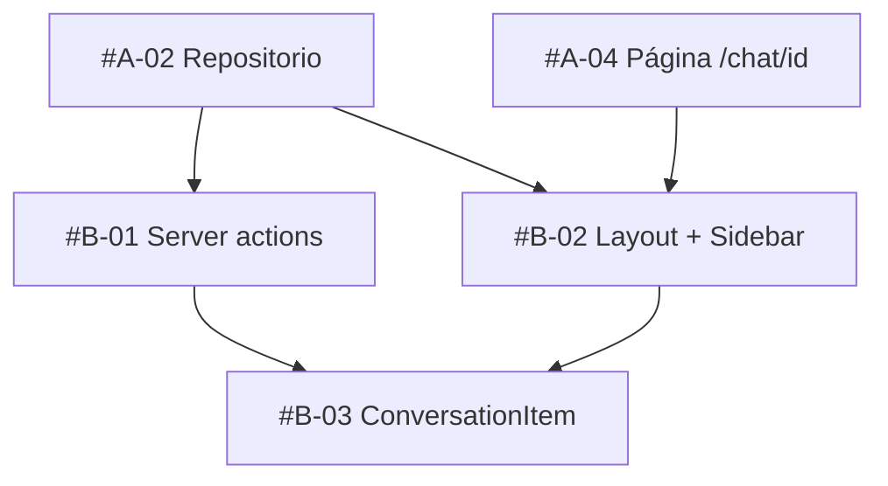

# [EPIC] Sidebar de conversaciones con renombrar y eliminar

## 📋 Summary
Añadir a `/chat` un sidebar persistente con la lista de conversaciones del usuario autenticado, un enlace "Nueva conversación", y acciones de renombrar (inline) y eliminar (con confirmación) sobre cada ítem. Se apoya en el repositorio user-scoped y las páginas `/chat/[conversationId]` entregadas por #EPIC-A.

## 🎯 Problem Statement
Tras #EPIC-A las conversaciones se guardan en Postgres, pero el usuario solo puede volver a una si conoce su URL. No hay forma de navegar entre conversaciones, de identificarlas por un título propio ni de borrar las que ya no interesan. Sin esto la persistencia aporta poco valor visible.

## 💡 Proposed Solution
- Un `layout.tsx` en `src/app/chat/` que renderiza un `<Sidebar />` server-side con las conversaciones ordenadas por `updatedAt desc` (via `listConversations(userId)` de #A-02).
- Server actions `renameConversationAction` y `deleteConversationAction` protegidas con `getSession()` y validadas con zod sobre `FormData`.
- Un `ConversationItem` cliente que permite renombrar inline y eliminar con confirmación usando `useActionState` (React 19).

## Sub-issues
- [ ] #B-01
- [ ] #B-02
- [ ] #B-03

## 🔧 Task Breakdown & Assignments

### Sub-Issues Overview
| Issue | Title                                                                  | Agent/Assignee      | Story Points | Priority | Dependencies | Completed |
| ----- | ---------------------------------------------------------------------- | ------------------- | ------------ | -------- | ------------ | --------- |
| #B-01 | [Sub-issue] Server actions renombrar/eliminar conversación             | @backend-architect  | 3            | P1       | #A-02        | [ ]       |
| #B-02 | [Sub-issue] Layout /chat con sidebar de conversaciones                 | @frontend-developer | 5            | P1       | #A-02, #A-04 | [ ]       |
| #B-03 | [Sub-issue] Item de conversación: renombrar inline y eliminar          | @frontend-developer | 3            | P1       | #B-01, #B-02 | [ ]       |

> **📝 Status Update Instructions:**
> Cuando un sub-issue se complete, edita esta descripción y marca `[x]` en la columna "Completed" y en la lista `## Sub-issues`.
> **NO** publiques actualizaciones de estado en comentarios. Esta tabla es la única fuente de verdad.

**Total Story Points**: 11

### Tiers de ejecución (para `/work-on-opens`)
- **Tier 0 (paralelo)**: #B-01, #B-02 — no comparten archivos.
- **Tier 1**: #B-03 — depende de ambos.

### Agent Assignments & Specializations
| Agent               | Specialization            | Assigned Tasks | Total Points | Skills/Tooling         |
| ------------------- | ------------------------- | -------------- | ------------ | ---------------------- |
| @backend-architect  | Server actions & data     | #B-01          | 3            | standalone             |
| @frontend-developer | App Router UI & React 19  | #B-02, #B-03   | 8            | component-reuse-first  |

### Claude Code Skills & Tooling
**Existing Skills to Use:**
- `component-reuse-first` — reutilizar `message-bubble.tsx`, `chat-panel.tsx` y las clases de `src/app/page.tsx` antes de crear componentes nuevos.

**Recommended New Skills:**
- Ninguna. El dominio es UI estándar de App Router.

### Dependency Graph

### Integration Points
- **#A-02 → #B-01**: `renameConversation(userId, id, title)` y `deleteConversation(userId, id)` del repositorio; las actions solo añaden auth + validación + revalidación.
- **#A-02 → #B-02**: `listConversations(userId)` alimenta el sidebar en el server component.
- **#A-04 → #B-02**: la ruta activa `/chat/[conversationId]` se resalta con `usePathname()`.
- **#B-01 & #B-02 → #B-03**: `ConversationItem` recibe `{ id, title, active }` y llama a las actions vía `useActionState`; el sidebar lo monta por cada conversación.

## ✅ Acceptance Criteria
- [ ] Todos los sub-issues completados y mergeados en `main`.
- [ ] Un usuario autenticado ve en `/chat` y `/chat/[id]` sus conversaciones ordenadas por última actividad, y nunca las de otro usuario.
- [ ] Renombrar actualiza el título en el sidebar sin recargar la página completa (`revalidatePath`).
- [ ] Eliminar la conversación activa redirige a `/chat`; eliminar otra mantiene la ruta actual.
- [ ] `bun run typecheck` y `bun run check` en verde.
- [ ] Sin cambios de comportamiento en `/api/chat`.

## 📎 Additional Context

### Related Issues
- #EPIC-A — persistencia de conversaciones (prerrequisito).
- #EPIC-C — settings por conversación (consume el mismo `actions.ts`).

### References
- `~/.claude/templates/GH_PARENT_ISSUE_TEMPLATE.md`
- Patrón de server actions con `getSession()` en `src/app/page.tsx`.

## 🏷️ Labels
`epic`, `P1`, `frontend`, `backend`

## 📅 Timeline
- **Start**: tras merge de #EPIC-A en `main`
- **Target Completion**: mismo sprint
- **Estimated Duration**: 11 story points

## 👥 Team
- **Owner**: @ronnycoding
- **Contributors**: @backend-architect, @frontend-developer
- **Reviewers**: @code-reviewer
