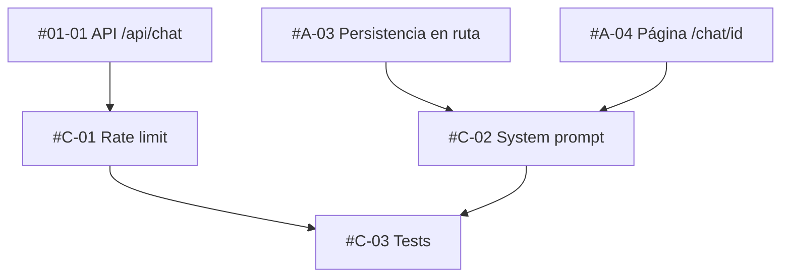

# [EPIC] System prompt por conversación, rate limit y tests

## 📋 Summary
Endurecer y completar el chatbot: un rate limit por usuario en `POST /api/chat`, un system prompt editable por conversación (la columna `systemPrompt` ya existe desde #A-01 y la ruta ya la lee desde #A-03), y una suite de tests con `bun test` que cubra el schema, el rate limit y el route handler con DeepSeek mockeado.

## 🎯 Problem Statement
- Sin rate limit, cualquier usuario autenticado puede agotar la cuota de DeepSeek (coste real por token).
- El system prompt es global (`DEFAULT_SYSTEM_PROMPT`); el usuario no puede adaptar el asistente a una conversación concreta.
- El repo no tiene tests; los slices anteriores solo se validan con `typecheck` y `check`. Sin tests, `/merge-and-test` no tiene contra qué verificar.

## 💡 Proposed Solution
- `src/server/ai/rate-limit.ts`: ventana deslizante por `userId` en un `Map` cacheado en `globalThis` (mismo patrón que `src/server/db/index.ts`), configurable con `CHAT_RATE_LIMIT_PER_MINUTE` (default 20). La ruta responde `429` + `Retry-After`.
- `updateSystemPromptAction` en `src/server/chat/actions.ts` y un `ChatSettings` colapsable en la cabecera del chat.
- Tests unitarios de `chat-schema` y `rate-limit`, y test del route handler con `mock.module` para el cliente DeepSeek y la sesión.

## Sub-issues
- [ ] #C-01
- [ ] #C-02
- [ ] #C-03

## 🔧 Task Breakdown & Assignments

### Sub-Issues Overview
| Issue | Title                                                                       | Agent/Assignee    | Story Points | Priority | Dependencies | Completed |
| ----- | --------------------------------------------------------------------------- | ----------------- | ------------ | -------- | ------------ | --------- |
| #C-01 | [Sub-issue] Rate limit por usuario en /api/chat (429 + Retry-After)         | @security-auditor | 3            | P2       | #01-01       | [ ]       |
| #C-02 | [Sub-issue] System prompt configurable por conversación                     | @ai-engineer      | 5            | P2       | #A-03, #A-04 | [ ]       |
| #C-03 | [Sub-issue] Tests: chat-schema, rate-limit y route handler con DeepSeek mock | @test-automator   | 5            | P2       | #C-01, #C-02 | [ ]       |

> **📝 Status Update Instructions:**
> Cuando un sub-issue se complete, edita esta descripción y marca `[x]` en la columna "Completed" y en la lista `## Sub-issues`.
> **NO** publiques actualizaciones de estado en comentarios. Esta tabla es la única fuente de verdad.

**Total Story Points**: 13

### Tiers de ejecución (para `/work-on-opens`)
- **Tier 0 (paralelo)**: #C-01, #C-02 — archivos disjuntos (#C-01 toca `route.ts` y `env.js`; #C-02 toca `actions.ts`, `chat-settings.tsx` y la página).
- **Tier 1**: #C-03 — necesita ambos para cubrirlos.

### Agent Assignments & Specializations
| Agent             | Specialization                | Assigned Tasks | Total Points | Skills/Tooling |
| ----------------- | ----------------------------- | -------------- | ------------ | -------------- |
| @security-auditor | Abuse prevention & API safety | #C-01          | 3            | standalone     |
| @ai-engineer      | LLM prompts & SDK             | #C-02          | 5            | claude-api     |
| @test-automator   | Test strategy & mocks         | #C-03          | 5            | standalone     |

### Claude Code Skills & Tooling
**Existing Skills to Use:**
- `claude-api` — referencia del SDK `@anthropic-ai/sdk` (parámetro `system`, `messages.stream()`), aplicable porque DeepSeek expone la misma interfaz.

**Recommended New Skills:**
- `deepseek-anthropic-compat` (opcional): documentar qué parámetros acepta el endpoint de DeepSeek (`model`, `max_tokens`, `system`, `messages`, `temperature`, `stream`) y cuáles rechaza (`top_k`, `thinking`, `output_config`, `cache_control`, `betas`) para que los agentes no generen llamadas inválidas.

### Dependency Graph

### Integration Points
- **#01-01 → #C-01**: `route.ts` llama a `checkRateLimit(userId)` justo después del guard de sesión y antes de cualquier llamada a DeepSeek.
- **#A-03 → #C-02**: la ruta ya aplica `conversation.systemPrompt ?? DEFAULT_SYSTEM_PROMPT`; #C-02 solo añade la forma de editarlo.
- **#A-04 → #C-02**: `[conversationId]/page.tsx` pasa `systemPrompt` al componente de settings.
- **#C-01 & #C-02 → #C-03**: los tests importan `rate-limit.ts` y ejercitan la ruta con el prompt personalizado mockeando el cliente DeepSeek.

## ✅ Acceptance Criteria
- [ ] Todos los sub-issues completados y mergeados en `main`.
- [ ] Superar `CHAT_RATE_LIMIT_PER_MINUTE` devuelve `429` con `Retry-After` y no llama a DeepSeek.
- [ ] El system prompt editado en una conversación se aplica en la siguiente petición de esa conversación y no afecta a otras.
- [ ] `bun test` pasa en local sin `DEEPSEEK_API_KEY` real (cliente mockeado).
- [ ] `bun run typecheck` y `bun run check` en verde.

## 📎 Additional Context

### Related Issues
- #EPIC-A — schema y ruta con persistencia (prerrequisito).
- #EPIC-B — comparte `src/server/chat/actions.ts`; #C-02 solo añade una función al final del archivo.

### References
- DeepSeek Anthropic API: https://api-docs.deepseek.com/guides/anthropic_api
- Bun test runner: `bun test`, `mock.module`.

## 🏷️ Labels
`epic`, `P2`, `backend`, `testing`

## 📅 Timeline
- **Start**: tras merge de #EPIC-A (y #B-01 si se quiere evitar conflicto en `actions.ts`)
- **Target Completion**: mismo sprint
- **Estimated Duration**: 13 story points

## 👥 Team
- **Owner**: @ronnycoding
- **Contributors**: @security-auditor, @ai-engineer, @test-automator
- **Reviewers**: @code-reviewer
