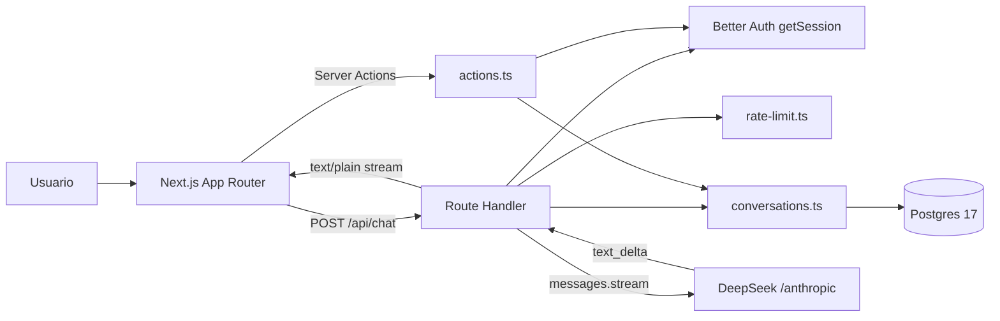
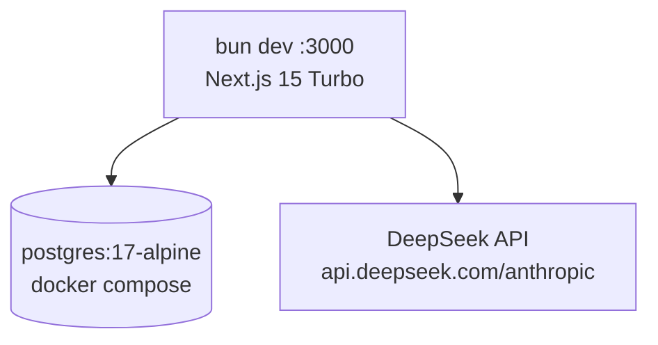

# Architecture Overview: Chatbot DeepSeek

**Date:** 2026-09-19
**Status:** Draft
**Version:** 1.0
**Base:** `issues/parent-chatbot-deepseek.md` + 13 sub-issues + `prompts/00-planificacion.md`

---

## Table of Contents

- [System Overview](#system-overview)
- [Architecture Principles](#architecture-principles)
- [Technology Stack Summary](#technology-stack-summary)
- [Application Domains](#application-domains)
- [Interconnection Patterns](#interconnection-patterns)
- [Data Flow](#data-flow)
- [Deployment Architecture](#deployment-architecture)
- [Security Architecture](#security-architecture)
- [Scalability Strategy](#scalability-strategy)
- [Development Workflow](#development-workflow)
- [Architecture Diagrams](#architecture-diagrams)
- [Technology Decisions & Trade-offs](#technology-decisions--trade-offs)
- [Risks & Known Gotchas](#risks--known-gotchas)
- [Migration & Evolution](#migration--evolution)

---

## System Overview

### Project Description

Chatbot web autenticado construido sobre el T3 stack existente (Next.js 15 App Router, React 19, Better Auth, Drizzle/Postgres, Bun, Biome). El LLM es **DeepSeek consumido a través de su endpoint compatible con la API de Anthropic** (`@anthropic-ai/sdk` con `baseURL: https://api.deepseek.com/anthropic`, modelo `deepseek-flash`).

El producto es deliberadamente pequeño pero completo: chat con respuesta streameada, historial por usuario, sidebar de conversaciones, system prompt por conversación, rate limit y tests. Sirve además como material de demostración de las tres metodologías del workshop (Issue-Driven, BDD, Epic-Driven).

### Target Scale

- **Expected Users:** workshop / prototipo (< 100 usuarios, decenas de conversaciones concurrentes)
- **Performance Target:** primer token visible en **< 2 s** con `deepseek-flash`
- **Availability:** best-effort local; sin SLA
- **Cost driver:** tokens de DeepSeek (`max_tokens` 4096 por respuesta)

### Key Features

1. Autenticación email/password obligatoria para todo el dominio de chat (Better Auth).
2. `POST /api/chat`: streaming de texto plano desde DeepSeek al navegador.
3. Persistencia de conversaciones y mensajes por usuario (Drizzle/Postgres).
4. Sidebar server-rendered con rename y delete vía server actions.
5. System prompt configurable por conversación, con fallback al prompt por defecto.
6. Rate limit por usuario (429 + `Retry-After`) y suite de tests con `bun test`.

---

## Architecture Principles

1. **Contrato congelado entre slices**: `POST /api/chat` y la firma del repositorio se definen una vez (#01-01, #A-02) y no se refactorizan. Cada slice posterior extiende, no reescribe.
2. **Server-first**: todo lo que puede renderizarse en el servidor lo hace. `"use client"` solo donde hay estado de streaming o interacción local (`ChatPanel`, `ChatSettings`, item de sidebar).
3. **Un solo proceso, sin capas de más**: sin tRPC, sin Vercel AI SDK, sin BFF separado. Route Handler para streaming + Server Actions para CRUD.
4. **User-scoped por construcción**: toda función de acceso a datos recibe `userId` como primer parámetro y filtra por él. No existe una consulta sin dueño.
5. **Secretos solo en el servidor**: `DEEPSEEK_API_KEY` vive en `src/env.js` (bloque `server`), nunca se expone al cliente ni se escribe en logs.
6. **Solo parámetros soportados por DeepSeek**: el endpoint compatible rechaza campos desconocidos con 400. La lista permitida es parte del contrato.
7. **Tipos estrictos**: TypeScript `strict` + `noUncheckedIndexedAccess` + `verbatimModuleSyntax`; zod valida todo input externo.

---

## Technology Stack Summary

| Domain | Primary Technology | Purpose | Documentation |
| ------ | ------------------ | ------- | ------------- |
| Frontend | Next.js 15 App Router + React 19 + Tailwind v4 | UI de chat, sidebar, streaming en cliente | [frontend.md](./frontend.md) |
| Backend | Route Handlers + Server Actions (Node runtime) | Streaming LLM, CRUD de conversaciones | [backend.md](./backend.md) |
| Database | Postgres 17 + Drizzle ORM 0.41 (`postgres.js`) | Persistencia de usuarios, conversaciones y mensajes | [database.md](./database.md) |
| API / LLM | `@anthropic-ai/sdk` → DeepSeek Anthropic-compatible | Contrato HTTP interno + integración con el modelo | [api.md](./api.md) |
| Authentication | Better Auth 1.3 (email/password, cookies) | Sesión, guards, ownership | [authentication.md](./authentication.md) |
| Infrastructure | Bun + Docker Compose (Postgres) | Entorno local del workshop | [infrastructure.md](./infrastructure.md) |
| Monitoring | Logs estructurados + `usage.output_tokens` | Observabilidad mínima del MVP | [monitoring.md](./monitoring.md) |
| Mobile | N/A | Fuera de alcance | — |

**Versiones fijadas** (`package.json`): `next` ^15.2.3, `react` ^19, `better-auth` ^1.3, `drizzle-orm` ^0.41, `postgres` ^3.4.4, `zod` ^3.24, `tailwindcss` ^4.0.15, `@biomejs/biome` ^2.2.5, `typescript` ^5.8.2. A añadir en #01-01: `@anthropic-ai/sdk` ^0.127.

---

## Application Domains

### Frontend Domain
- **Technology:** Next.js 15 App Router, React 19, Tailwind v4
- **Responsibility:** páginas `/`, `/chat`, `/chat/[conversationId]`; consumo del stream con `fetch` + `getReader()`; sidebar; formularios de settings
- **Rutas cliente:** solo `ChatPanel`, `ChatSettings` y el item de conversación son `"use client"`
- **Documentation:** [frontend.md](./frontend.md)

### Backend Domain
- **Technology:** Route Handler `src/app/api/chat/route.ts` + Server Actions en `src/server/chat/actions.ts`
- **Responsibility:** guard de sesión, rate limit, validación zod, orquestación del stream de DeepSeek, persistencia de mensajes, CRUD de conversaciones
- **Runtime:** Node (no `edge`: `postgres.js` y Better Auth lo requieren)
- **Documentation:** [backend.md](./backend.md)

### Database Domain
- **Technology:** Postgres 17-alpine + Drizzle ORM, conexión cacheada en `globalThis` fuera de producción
- **Responsibility:** tablas Better Auth (`user`, `session`, `account`, `verification`) + dominio propio (`pg-drizzle_conversation`, `pg-drizzle_message`)
- **Documentation:** [database.md](./database.md)

### AI / API Domain
- **Technology:** `@anthropic-ai/sdk` apuntando a `https://api.deepseek.com/anthropic`
- **Responsibility:** cliente `deepseek`, `DEFAULT_SYSTEM_PROMPT`, `chatRequestSchema`, contrato HTTP de `/api/chat`
- **Documentation:** [api.md](./api.md)

### Authentication Domain
- **Technology:** Better Auth con `drizzleAdapter` (`provider: "pg"`), plugin `nextCookies()` en último lugar
- **Responsibility:** sign in / sign up / sign out, `getSession()` cacheado con `React.cache`, ownership de conversaciones
- **Documentation:** [authentication.md](./authentication.md)

### Infrastructure Domain
- **Technology:** Bun, Docker Compose (solo Postgres), Biome, drizzle-kit
- **Responsibility:** entorno local reproducible del workshop, worktrees para la demo Epic-Driven
- **Documentation:** [infrastructure.md](./infrastructure.md)

---

## Interconnection Patterns

### Communication Architecture

#### Frontend ↔ Backend (chat)
- **Protocol:** HTTP `POST /api/chat`, respuesta `200 text/plain; charset=utf-8` streameada (no SSE, no JSON chunks)
- **Format:** entrada JSON, salida texto plano (deltas `text_delta` concatenados)
- **Authentication:** cookie de sesión Better Auth, same-origin (`fetch` la envía por defecto)
- **Cancelación:** `AbortController` en el cliente → `req.signal` → `stream.abort()` en el servidor
- **Base URL:** `/api/chat` relativa (mismo origen en dev y en cualquier despliegue)

**Example Request Flow:**
```
Usuario escribe → ChatPanel ("use client")
  → fetch POST /api/chat { messages, conversationId? }
  → Route Handler: getSession() → checkRateLimit() → zod → ownership
  → appendMessage(user)
  → deepseek.messages.stream({ model, max_tokens, system, messages })
  → ReadableStream: text_delta → TextEncoder → chunk HTTP
  → getReader() + TextDecoder en el cliente → setMessages funcional
  → finalMessage() → appendMessage(assistant) → controller.close()
```

#### Frontend ↔ Backend (CRUD)
- **Protocol:** Server Actions (`"use server"`) invocadas desde formularios; nunca `fetch`
- **Validación:** `FormData` parseado con zod dentro de la action
- **Revalidación:** `revalidatePath("/chat", "layout")` para el sidebar; `revalidatePath("/chat/<id>")` para settings
- **Motivo:** las server actions no pueden streamear texto; por eso el chat usa Route Handler y el CRUD usa actions

#### Backend ↔ Database
- **Connection:** `postgres.js` (driver) + Drizzle ORM; instancia cacheada en `globalThis` fuera de producción para sobrevivir a HMR
- **Access layer:** `src/server/chat/conversations.ts` — única puerta al dominio; toda función recibe `userId` primero
- **Migration Strategy:** `bun run db:push` en dev (workshop); `db:generate` + `db:migrate` reservados para producción

#### Backend ↔ DeepSeek
- **Protocol:** Anthropic Messages API (compatible) sobre HTTPS, `stream: true`
- **Parámetros permitidos:** `model`, `max_tokens`, `system`, `messages`, `temperature`
- **Parámetros prohibidos:** `top_k`, `thinking`, `output_config`, `cache_control`, `betas`, `fallbacks`, `mcp_servers` → 400 inmediato
- **Errores:** `Anthropic.APIError` antes del primer byte → 502 JSON; fallo a mitad de stream → `controller.error(err)`

### API Contracts

#### `POST /api/chat`
- **Versioning:** ninguno. Ruta estable `/api/chat`; el contrato se congela en #01-01 y se extiende de forma aditiva en #A-03 (header `X-Conversation-Id`, 404) y #C-01 (429).
- **Request:**
  ```json
  {
    "messages": [{ "role": "user", "content": "hola" }],
    "conversationId": "uuid-opcional"
  }
  ```
  Reglas: 1..50 mensajes, `content` 1..8000 caracteres, el último mensaje debe tener `role: "user"`.
- **Responses:**

  | Status | Body | Headers |
  | ------ | ---- | ------- |
  | 200 | texto del asistente streameado | `Content-Type: text/plain; charset=utf-8`, `Cache-Control: no-cache, no-transform`, `X-Accel-Buffering: no`, `X-Conversation-Id: <uuid>` |
  | 400 | `{ "error": "Invalid request", "issues": ZodIssue[] }` | — |
  | 401 | `{ "error": "Unauthorized" }` | — |
  | 404 | `{ "error": "Conversation not found" }` | — |
  | 429 | `{ "error": "Rate limited" }` | `Retry-After: <segundos>` |
  | 502 | `{ "error": "Upstream error" }` | — |

Detalle completo en [api.md](./api.md).

#### Repositorio (`src/server/chat/conversations.ts`)
```ts
createConversation(userId, title?)                    → Conversation
getConversation(userId, id)                           → Conversation | null
listConversations(userId)                             → Conversation[]   // updatedAt desc
listMessages(userId, conversationId)                  → Message[]        // createdAt asc
appendMessage(userId, conversationId, role, content)  → Message          // bumps updatedAt
renameConversation(userId, id, title)                 → Conversation | null
deleteConversation(userId, id)                        → boolean
updateSystemPrompt(userId, id, prompt | null)         → Conversation | null
```

### Authentication Flow

```
1. Usuario envía el formulario en `/` (server action inline "use server")
2. auth.api.signInEmail / signUpEmail con headers() reenviados
3. Better Auth valida contra la tabla `user` / `account` (Drizzle adapter)
4. nextCookies() escribe la cookie de sesión desde la server action
5. redirect("/") en éxito · redirect("/?error=...") en fallo
6. Cada página y route handler llama getSession() (React cache, 1 query por request)
7. Sin sesión: páginas → redirect; /api/chat → 401 JSON antes de cualquier llamada upstream
8. Ownership: session.user.id se pasa como primer argumento a toda función del repositorio
```

---

## Data Flow

### Primary Data Flow Diagram



Ver [diagrams/data-flow.mmd](./diagrams/data-flow.mmd) para el diagrama de secuencia detallado.

### Data Flow Patterns

#### Read (abrir una conversación)
1. `GET /chat/[conversationId]` (server component)
2. `getSession()` → sin sesión, `redirect("/?error=...")`
3. `getConversation(userId, id)` → `null` ⇒ `notFound()`
4. `listMessages(userId, id)` → props `initialMessages` de `ChatPanel`
5. HTML server-rendered; el cliente hidrata solo el panel

#### Write (enviar un mensaje)
1. `ChatPanel` añade el mensaje del usuario y un placeholder vacío del asistente (update funcional)
2. `POST /api/chat` con el historial en memoria
3. Servidor: sesión → rate limit → zod → ownership/creación de conversación → `appendMessage("user")`
4. `system = conversation.systemPrompt ?? DEFAULT_SYSTEM_PROMPT`
5. Stream de DeepSeek: cada `text_delta` se encola y llega al cliente
6. `finalMessage()` → `appendMessage("assistant", texto)` → `controller.close()`
7. Si el cliente cancela: `stream.abort()` y se persiste el texto parcial acumulado
8. Si la página no tenía id: `router.replace("/chat/" + X-Conversation-Id)`

#### CRUD (rename / delete / system prompt)
1. Formulario → server action con `FormData`
2. `getSession()` + zod + función del repositorio filtrada por `userId`
3. `revalidatePath("/chat", "layout")` (sidebar) o `revalidatePath("/chat/<id>")` (settings)
4. React re-renderiza el árbol server sin recarga completa

---

## Deployment Architecture

**Alcance elegido: solo local (workshop).** No hay entorno de staging ni de producción en este MVP.

| Environment | Purpose | Hosting | URL |
| ----------- | ------- | ------- | --- |
| Development | Workshop y desarrollo | `bun dev` + Docker Compose | http://localhost:3000 |
| Database | Postgres del workshop | contenedor `postgres:17-alpine` | `localhost:${POSTGRES_PORT}` (default 5434) |
| Producción | Fuera de alcance | — | ver nota abajo |

**Nota de producción (no implementada):** el único requisito duro es **Node runtime** (no edge) por `postgres.js` y Better Auth. Cualquier host que lo soporte sirve: contenedor con `next start`, o serverless con Postgres gestionado. Si se va a serverless, el rate limit en memoria deja de ser global y hay que moverlo a Redis (ver [infrastructure.md](./infrastructure.md)).



Ver [diagrams/deployment.mmd](./diagrams/deployment.mmd).

---

## Security Architecture

### 1. Network
- **Same-origin:** el navegador solo habla con su propio origen; no hay CORS que configurar.
- **TLS:** obligatorio hacia DeepSeek (HTTPS). En local, el tráfico app↔Postgres no sale de la máquina.
- **Rate limiting:** `checkRateLimit(userId)` inmediatamente después del guard de sesión, ventana de 60 s, `CHAT_RATE_LIMIT_PER_MINUTE` (default 20) → 429 + `Retry-After`.

### 2. Authentication & Authorization
- **Method:** Better Auth email/password, sesión en cookie httpOnly gestionada por `nextCookies()`
- **Guard:** `getSession()` antes de validar el body y **antes de cualquier llamada upstream** (una petición anónima nunca gasta tokens)
- **Authorization:** modelo simple *authenticated / owner*. No hay roles. La autorización es ownership: toda consulta filtra por `userId`; conversación ajena ⇒ 404 (no 403, para no filtrar existencia)

### 3. Data
- **Passwords:** hasheadas por Better Auth (tabla `account.password`)
- **Cascade:** borrar un usuario borra sesiones, cuentas, conversaciones y mensajes (`onDelete: "cascade"`)
- **Contenido de chat:** se almacena en claro en Postgres; sin cifrado en reposo en el MVP (documentado como limitación)
- **Secretos:** `DEEPSEEK_API_KEY` y `BETTER_AUTH_SECRET` solo en el bloque `server` de `src/env.js`; nunca `NEXT_PUBLIC_*`, nunca en `console.*`

### 4. Application
- **Input validation:** `chatRequestSchema` (zod) limita 50 mensajes × 8000 caracteres; las server actions validan `FormData` con zod
- **SQL injection:** consultas parametrizadas por Drizzle/`postgres.js`
- **XSS:** React escapa por defecto; la respuesta del modelo se renderiza como texto, sin `dangerouslySetInnerHTML` ni markdown-to-HTML en el MVP
- **CSRF:** las server actions de Next.js validan origen; las cookies de Better Auth son same-origin

---

## Scalability Strategy

El MVP es de un solo proceso. Los límites conocidos y su salida:

| Componente | Límite actual | Cuándo duele | Evolución |
| ---------- | ------------- | ------------ | --------- |
| Rate limit | `Map` en memoria del proceso | 2+ instancias o serverless | Redis / Upstash con la misma firma `checkRateLimit` |
| Conexión DB | pool único de `postgres.js` | muchas instancias | PgBouncer o pool gestionado |
| Historial | se envía completo en cada petición | conversaciones largas (coste y latencia) | ventana deslizante + resumen |
| Streaming | 1 request = 1 conexión abierta | concurrencia alta | sin cambio de diseño; escalar horizontalmente |
| Sidebar | `listConversations` sin paginación | > ~200 conversaciones | paginación por `updatedAt` (índice ya existe) |

**Índices ya previstos:** `conversation_user_updated_idx (userId, updatedAt)` y `message_conversation_created_idx (conversationId, createdAt)` cubren las dos consultas calientes.

**Caching:** ninguno en el MVP. `getSession()` está cacheado por request con `React.cache`. Las respuestas del LLM **no** se cachean (`Cache-Control: no-cache, no-transform` y `X-Accel-Buffering: no` para evitar buffering de proxies).

---

## Development Workflow

### Prerequisites
- Bun (gestor de paquetes y runner de tests)
- Docker (Postgres 17)
- API key de DeepSeek: https://platform.deepseek.com/api_keys

### Setup
```bash
cp .env.example .env          # completar DEEPSEEK_API_KEY y BETTER_AUTH_SECRET
docker compose up -d          # Postgres 17-alpine
bun install
bun run db:push               # crea las tablas
bun dev                       # http://localhost:3000
```

### Comandos de calidad
```bash
bun run typecheck   # tsc --noEmit
bun run check       # biome lint + format
bun run check:write # autofix seguro (ejecutar antes de commitear)
bun test            # bun test (desde #A-02)
```

### Git Workflow
- **Branching:** una rama por sub-issue; worktrees en `.worktrees/` para la demo Epic-Driven
- **Commits:** Conventional Commits
- **PR:** `/pr` → `/code-review`; sin hallazgos críticos abiertos antes de mergear
- **Orden de merge:** #01-01 → #01-02 → Epic A (A-01 → A-02 → A-03/A-04) → Epic B → Epic C

### Metodologías del workshop
| Slice | Issues | Metodología | Prompt |
| ----- | ------ | ----------- | ------ |
| S1 | #01-01 | Issue-Driven | `prompts/01-issue-driven.md` |
| S2 | #01-02 | BDD | `prompts/02-bdd.md` |
| S3 | Epics A/B/C | Epic-Driven | `prompts/03-epic-driven.md` |

---

## Architecture Diagrams

- [diagrams/system-overview.mmd](./diagrams/system-overview.mmd) — capas y componentes
- [diagrams/data-flow.mmd](./diagrams/data-flow.mmd) — secuencia de una petición de chat con streaming
- [diagrams/deployment.mmd](./diagrams/deployment.mmd) — topología local del workshop

Render: GitHub los muestra nativamente; en VS Code con "Markdown Preview Mermaid Support"; online en https://mermaid.live/

---

## Technology Decisions & Trade-offs

### 1. DeepSeek vía endpoint compatible con Anthropic (no SDK propio, no OpenAI-compat)
- **Contexto:** hace falta un modelo barato con streaming y un SDK maduro.
- **Decisión:** `@anthropic-ai/sdk` con `baseURL: https://api.deepseek.com/anthropic`, modelo `deepseek-flash`.
- **Rationale:** tipado y `messages.stream()` de primera calidad; cambiar de proveedor es cambiar dos variables de entorno.
- **Trade-offs:** el subconjunto soportado es menor que el de Anthropic real; cualquier parámetro extra devuelve 400. Hay que auditar cada llamada.
- **Alternativas:** Vercel AI SDK (abstracción extra y menos control del contrato HTTP), API OpenAI-compat de DeepSeek (otro SDK, mismo resultado).

### 2. Route Handler para el chat, Server Actions para el CRUD
- **Contexto:** React 19 permite hacer casi todo con server actions.
- **Decisión:** el chat usa `POST /api/chat`; rename/delete/system prompt usan server actions.
- **Rationale:** las server actions no pueden devolver un stream de texto incremental; un Route Handler sí, y además es testeable con `curl`.
- **Trade-offs:** dos estilos de comunicación en la misma app; se documenta explícitamente cuál usar.

### 3. Texto plano en lugar de SSE
- **Decisión:** `text/plain` con deltas concatenados, leído con `getReader()` + `TextDecoder`.
- **Rationale:** sin framing que parsear, sin `EventSource` (que es GET-only y no permite enviar el historial).
- **Trade-offs:** no hay canal para metadatos a mitad de stream; por eso `X-Conversation-Id` viaja en el header inicial.

### 4. Rate limit en memoria
- **Decisión:** `Map<string, number[]>` cacheado en `globalThis` fuera de producción.
- **Rationale:** cero dependencias, suficiente para el workshop, función pura testeable inyectando `now`.
- **Trade-offs:** no sobrevive a reinicios ni funciona con múltiples instancias. Documentado como limitación explícita.

### 5. Drizzle con prefijo `pg-drizzle_` para el dominio y tablas sin prefijo para Better Auth
- **Decisión:** mantener ambos y arreglar `tablesFilter` en `drizzle.config.ts`.
- **Rationale:** Better Auth espera nombres exactos; el resto del dominio usa el helper `createTable` ya presente.
- **Trade-offs:** el filtro de drizzle-kit debe listar ambos conjuntos (`["pg-drizzle_*", "user", "session", "account", "verification"]`).

### 6. Node runtime, no Edge
- **Decisión:** los route handlers corren en Node.
- **Rationale:** `postgres.js` y Better Auth requieren APIs de Node.
- **Trade-offs:** sin arranque en edge; irrelevante para el alcance local.

---

## Risks & Known Gotchas

| Riesgo | Impacto | Mitigación |
| ------ | ------- | ---------- |
| Puerto de Postgres inconsistente: `.env.example` y `.env` usan **5464**, `docker-compose.yml` cae a **5434** si `POSTGRES_PORT` no está definido, y `CLAUDE.md` documenta 5434 | `db:push` falla o apunta a otra base | Fijar `POSTGRES_PORT` en `.env` y alinear los tres archivos; `src/test/setup.ts` debe usar el mismo puerto |
| `tablesFilter` actual (`desarrollo-de-software-con-ia_*`) no casa con ninguna tabla | `db:push` / `db:generate` ignoran el schema | Corregir en #A-01 antes de tocar nada de persistencia |
| `drizzle.config.ts` importa `~/env` | `db:push` exige `DEEPSEEK_API_KEY` tras #01-01 | Definirla o usar `SKIP_ENV_VALIDATION=1` |
| Parámetro no soportado hacia DeepSeek | 400 inmediato, demo rota | Lista blanca en [api.md](./api.md); revisión obligatoria en `/code-review` |
| Worktrees sin `.env` ni `node_modules` | Validación de env falla en la demo Epic-Driven | Copiar `.env` y `bun install` en cada worktree |
| Postgres compartido entre worktrees | Conflictos de schema | Mergear Epic A antes de arrancar Epic B |
| Historial completo en cada petición | Coste creciente por conversación larga | Documentado; ventana deslizante como evolución |
| Contenido de chat en claro | Privacidad | Aceptado en el MVP; anotado en [database.md](./database.md) |

---

## Migration & Evolution

### Hitos de evolución
- **Multi-instancia:** mover `checkRateLimit` a Redis conservando la firma; PgBouncer delante de Postgres.
- **Conversaciones largas:** ventana deslizante de mensajes + resumen persistido en `conversation`.
- **Producción:** añadir `db:generate` + `db:migrate` al pipeline, health check y despliegue en contenedor.
- **Observabilidad:** OpenTelemetry alrededor del route handler y Sentry para errores de cliente (ver [monitoring.md](./monitoring.md)).
- **Features fuera del MVP:** tool use / function calling, adjuntos, multi-modelo, compartir conversaciones, facturación.

### Versiones objetivo
| Versión | Contenido |
| ------- | --------- |
| v0.1.0 | API de chat streaming (#01-01) |
| v0.2.0 | UI `/chat` (#01-02) |
| v0.3.0 | Persistencia + sidebar (Epics A y B) |
| v0.4.0 | Settings, rate limit y tests (Epic C) |

---

## Appendix

### Glossary
- **Slice:** unidad de trabajo del workshop que corresponde a una metodología (S1, S2, S3).
- **Delta (`text_delta`):** fragmento incremental de texto emitido por el modelo durante el streaming.
- **User-scoped:** toda operación de datos filtra por el `userId` de la sesión.
- **Anthropic-compatible endpoint:** API de DeepSeek que habla el protocolo Messages de Anthropic con un subconjunto de parámetros.

### References
- [DeepSeek — Anthropic API compatibility](https://api-docs.deepseek.com/guides/anthropic_api)
- [DeepSeek API docs](https://api-docs.deepseek.com/)
- [Better Auth](https://www.better-auth.com/)
- [Drizzle ORM](https://orm.drizzle.team/)
- [Next.js App Router](https://nextjs.org/docs/app)
- `issues/parent-chatbot-deepseek.md` — epic y desglose en sub-issues
- `prompts/README.md` — orden de ejecución de las demos

### Contact & Ownership
- **Architecture Owner:** @ronnycoding
- **Last Updated:** 2026-09-19
- **Review Cycle:** al cerrar cada epic

---

**Document Version:** 1.0
**Status:** Draft
