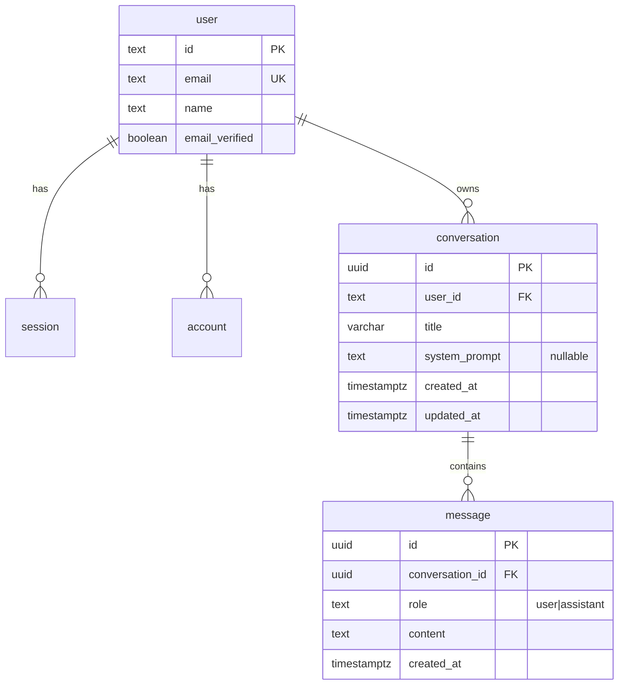

# Database Architecture

**Domain:** Database & Data Layer
**Primary Technology:** PostgreSQL 17 + Drizzle ORM 0.41
**Last Updated:** 2026-09-19

---

## Technology Stack

| Capa | Tecnología | Versión | Notas |
| ---- | ---------- | ------- | ----- |
| Motor | PostgreSQL | 17-alpine (Docker) | `docker compose up -d` |
| Driver | `postgres` (postgres.js) | ^3.4.4 | conexión cacheada en `globalThis` fuera de producción |
| ORM | `drizzle-orm` | ^0.41 | schema en TypeScript, consultas tipadas |
| CLI | `drizzle-kit` | ^0.30 | `db:push`, `db:generate`, `db:migrate`, `db:studio` |
| Caché | ninguna | — | sin Redis en el MVP |
| Búsqueda | ninguna | — | sin motor de búsqueda; el sidebar lista por fecha |

---

## Conexión

`src/server/db/index.ts` cachea la instancia de `postgres` en `globalThis` fuera de producción para sobrevivir al Hot Module Replacement de Next.js. Sin esto, cada recarga abriría un pool nuevo y agotaría las conexiones de Postgres en minutos.

El mismo patrón se replica en `src/server/ai/rate-limit.ts` para el almacén en memoria.

---

## Schema

### Tablas de Better Auth (sin prefijo)

Creadas con `pgTable` y nombres exactos: `user`, `session`, `account`, `verification`. Better Auth espera estos nombres de tabla y de columna; cambiarlos obliga a reconfigurar el adaptador.

| Tabla | Claves | Cascada |
| ----- | ------ | ------- |
| `user` | `id` (text, PK), `email` unique | — |
| `session` | `userId` → `user.id` | `onDelete: cascade` |
| `account` | `userId` → `user.id`, guarda `password` hasheada | `onDelete: cascade` |
| `verification` | `identifier`, `value`, `expiresAt` | — |

### Tablas del dominio (prefijo `pg-drizzle_`)

Creadas con el helper existente `createTable = pgTableCreator((name) => "pg-drizzle_" + name)`.

#### `pg-drizzle_conversation`
| Columna | Tipo | Notas |
| ------- | ---- | ----- |
| `id` | `uuid` PK | `defaultRandom()` |
| `userId` | `text` NOT NULL | FK → `user.id`, `onDelete: cascade`. **`text`, no `varchar`**, para casar exactamente con `user.id` |
| `title` | `varchar(120)` NOT NULL | default `"New conversation"`; se rellena con el primer mensaje recortado a 60 caracteres |
| `systemPrompt` | `text` NULL | creada ya en #A-01 para que #C-02 no necesite una segunda migración |
| `createdAt` | `timestamptz` NOT NULL | `$defaultFn` |
| `updatedAt` | `timestamptz` NOT NULL | `$defaultFn` + `$onUpdate` |

Índice: `conversation_user_updated_idx (userId, updatedAt)` — cubre el listado del sidebar.

#### `pg-drizzle_message`
| Columna | Tipo | Notas |
| ------- | ---- | ----- |
| `id` | `uuid` PK | `defaultRandom()` |
| `conversationId` | `uuid` NOT NULL | FK → `conversation.id`, `onDelete: cascade` |
| `role` | `text({ enum: ["user", "assistant"] })` NOT NULL | `text` con enum en vez de `pgEnum`, que no recibiría el prefijo |
| `content` | `text` NOT NULL | sin límite en DB; el límite de 8000 caracteres lo aplica zod en la entrada |
| `createdAt` | `timestamptz` NOT NULL | `$defaultFn` |

Índice: `message_conversation_created_idx (conversationId, createdAt)` — cubre la carga del historial.

> Los nombres de índice son globales en Postgres y `pgTableCreator` **no** los prefija: por eso son descriptivos y únicos.

### Relaciones

```ts
conversationRelations: conversation → one(user), many(message)
messageRelations:      message → one(conversation)
userRelations:         user → many(account), many(session), many(conversation)
```

### Tabla heredada

`pg-drizzle_post` viene del scaffolding de `create-t3-app` y no se usa. Su columna `createdById` es `varchar(255)` mientras `user.id` es `text`: inconsistencia conocida que **no se toca** (cambiarla no aporta nada al MVP y arriesga la demo).

---

## ERD



---

## Known gotcha: `tablesFilter`

Estado actual de `drizzle.config.ts`:

```ts
tablesFilter: ["desarrollo-de-software-con-ia_*"],
```

**Ninguna tabla del proyecto casa con ese patrón**: el dominio usa el prefijo `pg-drizzle_` y las tablas de Better Auth no llevan prefijo. Resultado: `db:push` y `db:generate` pueden ignorar el schema entero.

Corrección (#A-01, antes de cualquier trabajo de persistencia):

```ts
tablesFilter: ["pg-drizzle_*", "user", "session", "account", "verification"],
```

Tras el fix, actualizar la sección "Known gotcha: table prefix mismatch" de `CLAUDE.md` con el estado real.

---

## Migrations

| Comando | Uso |
| ------- | --- |
| `bun run db:push` | **dev / workshop.** Sincroniza el schema directamente, sin archivos SQL |
| `bun run db:generate` | genera SQL versionado (reservado para producción) |
| `bun run db:migrate` | aplica migraciones generadas |
| `bun run db:studio` | explorador visual de drizzle-kit |

En el workshop se usa `db:push` exclusivamente: no hay migraciones versionadas en el repo.

`drizzle.config.ts` importa `~/env`, así que cualquier comando `db:*` valida el entorno completo — incluida `DEEPSEEK_API_KEY` una vez añadida en #01-01. Alternativa: `SKIP_ENV_VALIDATION=1 bun run db:push`.

---

## Consultas del dominio

Todas viven en `src/server/chat/conversations.ts` (ver [backend.md](./backend.md)). Patrones:

| Operación | Consulta | Índice usado |
| --------- | -------- | ------------ |
| Sidebar | `select ... where userId = ? order by updatedAt desc` | `conversation_user_updated_idx` |
| Historial | `select ... where conversationId = ? order by createdAt asc` (con ownership verificado) | `message_conversation_created_idx` |
| Append | `insert into message` + `update conversation set updatedAt` en una transacción | PK |
| Delete | `delete from conversation where id = ? and userId = ?` | los mensajes caen por cascada |

**Regla de ownership:** ninguna consulta se ejecuta sin `userId`. Una conversación de otro usuario devuelve `null`, que la capa HTTP traduce a 404.

---

## Data Security & Privacy

- **Passwords:** hasheadas por Better Auth en `account.password`; la aplicación nunca las manipula
- **Contenido de chat:** almacenado en claro. Sin cifrado en reposo en el MVP — limitación aceptada y documentada
- **Borrado:** eliminar un usuario elimina en cascada sesiones, cuentas, conversaciones y mensajes
- **Retención:** indefinida; no hay purga automática de conversaciones
- **PII:** email y nombre del usuario. Sin datos de pago, sin adjuntos

---

## Performance

- Dos índices compuestos cubren las dos consultas calientes; no hacen falta más en el MVP
- Sin paginación: `listConversations` devuelve todo. A partir de ~200 conversaciones por usuario, paginar por `updatedAt` (el índice ya lo soporta)
- `content` es `text` sin límite: una conversación muy larga crece en filas, no en anchura de fila
- Sin caché de consultas: la latencia dominante es el LLM, no Postgres

---

## Interconnections

### ← Backend
Repositorio `src/server/chat/conversations.ts`; nadie más importa Drizzle desde el dominio de chat. Ver [backend.md](./backend.md).

### ← Authentication
Better Auth escribe y lee `user`, `session`, `account`, `verification` a través del `drizzleAdapter`. Ver [authentication.md](./authentication.md).

### ← Infrastructure
Contenedor `postgres:17-alpine` de `docker-compose.yml`, volumen `postgres_data`. Ver [infrastructure.md](./infrastructure.md).

---

## Troubleshooting

| Síntoma | Causa probable | Solución |
| ------- | -------------- | -------- |
| `db:push` no detecta cambios | `tablesFilter` mal configurado | aplicar el fix de #A-01 |
| `ECONNREFUSED` en el puerto de Postgres | contenedor caído o puerto distinto | `docker compose up -d`; alinear `POSTGRES_PORT` con `DATABASE_URL` |
| "too many connections" tras varias recargas | pool no cacheado en `globalThis` | mantener el patrón de `src/server/db/index.ts` |
| FK violation al insertar una conversación | `userId` de una sesión de otra base | recrear la sesión tras cambiar de base |
| Conflictos de schema entre worktrees | todos comparten el mismo Postgres | mergear Epic A antes de arrancar Epic B |

---

**Maintained by:** @database-optimizer
**Review cycle:** al cerrar Epic A
