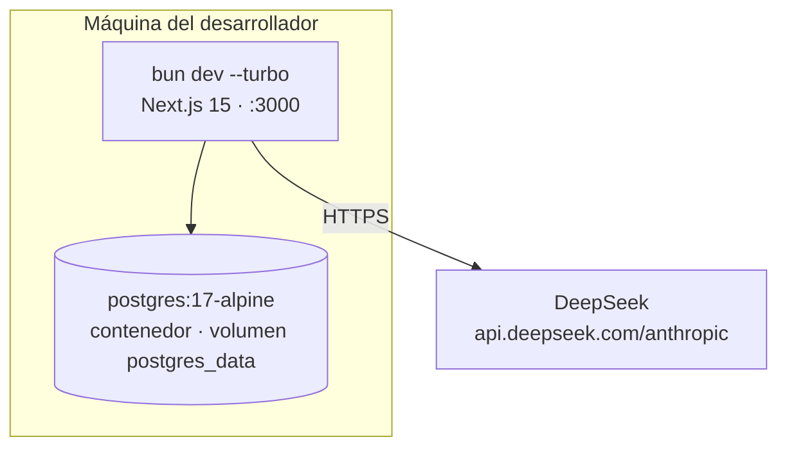

# Infrastructure & DevOps

**Domain:** Infrastructure
**Scope:** entorno local del workshop (sin staging ni producción)
**Last Updated:** 2026-09-19

---

## Alcance

Este MVP se ejecuta **solo en local**. No hay proveedor cloud, ni CI/CD, ni infraestructura como código. La decisión es deliberada: el proyecto es material de workshop y el único entorno que debe funcionar de forma reproducible es la máquina del presentador (y la de cada asistente).

| Componente | Solución |
| ---------- | -------- |
| Runtime de la app | Bun + `next dev --turbo` en `:3000` |
| Base de datos | contenedor `postgres:17-alpine` vía Docker Compose |
| LLM | servicio externo (DeepSeek), sin infraestructura propia |
| CI/CD | ninguno |
| IaC | ninguno |
| Contenedores de la app | ninguno (la app no se containeriza) |

---

## Topología local



---

## Docker Compose

`docker-compose.yml` levanta **solo Postgres**:

```yaml
services:
  postgres:
    image: postgres:17-alpine
    container_name: desarrollo-de-software-con-ia-postgres
    restart: unless-stopped
    environment:
      POSTGRES_USER: ${POSTGRES_USER:-postgres}
      POSTGRES_PASSWORD: ${POSTGRES_PASSWORD:-password}
      POSTGRES_DB: ${POSTGRES_DB:-desarrollo-de-software-con-ia}
    ports:
      - "${POSTGRES_PORT:-5434}:5432"
    volumes:
      - postgres_data:/var/lib/postgresql/data
    healthcheck:
      test: ["CMD-SHELL", "pg_isready -U ${POSTGRES_USER:-postgres} -d ${POSTGRES_DB:-desarrollo-de-software-con-ia}"]
      interval: 5s
      timeout: 5s
      retries: 10
```

Alternativa: `./start-database.sh` parsea `DATABASE_URL` y arranca un contenedor plano. Usar **una u otra**, no las dos (chocan por el puerto).

### ⚠️ Puerto de Postgres: inconsistencia activa

| Fuente | Puerto |
| ------ | ------ |
| `docker-compose.yml` (default) | **5434** |
| `CLAUDE.md` | **5434** |
| `.env.example` (estado actual del working tree) | **5464** |
| `.env` local | **5464** (con `POSTGRES_PORT` definido) |
| `src/test/setup.ts` propuesto en #A-02 | **5434** |

El compose respeta `POSTGRES_PORT`, así que en esta máquina el contenedor escucha en 5464 y la app conecta bien — pero cualquiera que clone el repo y no defina `POSTGRES_PORT` levantará Postgres en 5434 mientras `.env.example` apunta a 5464, y `db:push` fallará con `ECONNREFUSED`.

**Acción recomendada:** elegir un puerto, y alinear `docker-compose.yml`, `.env.example`, `CLAUDE.md` y el `DATABASE_URL` por defecto de `src/test/setup.ts`. Definir siempre `POSTGRES_PORT` en `.env`.

---

## Setup reproducible

```bash
# 1. Variables de entorno
cp .env.example .env
#    completar: DEEPSEEK_API_KEY, BETTER_AUTH_SECRET, POSTGRES_PORT

# 2. Base de datos
docker compose up -d
docker compose ps        # esperar healthcheck "healthy"

# 3. Dependencias y schema
bun install
bun run db:push          # necesita DEEPSEEK_API_KEY o SKIP_ENV_VALIDATION=1

# 4. App
bun dev                  # http://localhost:3000
```

---

## Variables de entorno

Fuente de verdad: `src/env.js` (`@t3-oss/env-nextjs` + zod). Toda variable nueva se declara ahí **y** en `.env.example`.

| Variable | Requerida | Default | Consumidor |
| -------- | --------- | ------- | ---------- |
| `DATABASE_URL` | sí | — | Drizzle, drizzle-kit, Better Auth |
| `BETTER_AUTH_SECRET` | en producción | — | Better Auth |
| `DEEPSEEK_API_KEY` | sí (desde #01-01) | — | cliente Anthropic SDK |
| `DEEPSEEK_BASE_URL` | no | `https://api.deepseek.com/anthropic` | cliente |
| `DEEPSEEK_MODEL` | no | `deepseek-flash` | cliente |
| `CHAT_RATE_LIMIT_PER_MINUTE` | no | `20` | rate limit |
| `POSTGRES_PORT` / `POSTGRES_USER` / `POSTGRES_PASSWORD` / `POSTGRES_DB` | no | ver compose | solo Docker Compose |
| `SKIP_ENV_VALIDATION` | no | — | escape hatch para builds y comandos `db:*` |

`SKIP_ENV_VALIDATION=1` salta toda la validación: útil para `db:push` sin la clave de DeepSeek, peligroso si se deja puesto (la app arrancaría con variables ausentes).

---

## Calidad local (el "CI" del proyecto)

No hay pipeline. La puerta de calidad es manual y se ejecuta antes de cada PR:

```bash
bun run typecheck   # tsc --noEmit
bun run check       # biome lint + format (tabs, imports, clases Tailwind)
bun run check:write # autofix seguro
bun test            # desde #A-02
```

**Si más adelante se añade CI** (GitHub Actions), el job mínimo sería: `bun install` → `bun run typecheck` → `bun run check` → `bun test`, con `SKIP_ENV_VALIDATION=1` y un servicio `postgres:17-alpine` para los tests del repositorio.

---

## Git worktrees (demo Epic-Driven)

La metodología Epic-Driven ejecuta agentes en paralelo sobre `.worktrees/*`.

| Riesgo | Efecto | Mitigación |
| ------ | ------ | ---------- |
| Worktree sin `.env` | la validación de env falla al arrancar | copiar `.env` a cada worktree |
| Worktree sin `node_modules` | `bun dev` no arranca | `bun install` en cada worktree |
| Postgres compartido | conflictos de schema entre ramas | mergear Epic A (schema) **antes** de arrancar Epic B |
| Cookies same-origin | la sesión no se comparte entre puertos | cada worktree se prueba contra su propio `bun dev` |
| `/merge-and-test` asume `pnpm dev` en `:3333` | comandos que no existen aquí | este proyecto usa `bun dev` en `:3000`; el prompt lo indica explícitamente |

Inspección: `git worktree list`.

---

## Camino a producción (no implementado)

Requisito duro: **Node runtime**, no edge (`postgres.js` y Better Auth). Con eso, dos caminos válidos:

| Opción | Qué implica | Punto de atención |
| ------ | ----------- | ----------------- |
| Contenedor (`next start`) | Dockerfile multi-stage con Bun, Postgres gestionado o en compose | el rate limit en memoria funciona por contenedor |
| Serverless (p. ej. Vercel) | Postgres gestionado + pooling (PgBouncer/driver serverless) | el rate limit en memoria **deja de ser global**: mover a Redis |

En ambos casos, antes de desplegar: `BETTER_AUTH_SECRET` obligatoria, migraciones versionadas (`db:generate` + `db:migrate`) en lugar de `db:push`, y HTTPS terminado en el proxy.

**Coste:** infraestructura propia ~0 € en local. El único coste variable es DeepSeek, proporcional a los tokens (`max_tokens` 4096 por respuesta y el historial completo reenviado en cada petición — el driver de coste dominante en conversaciones largas).

---

## Backup y recuperación

No hay estrategia de backup: el volumen `postgres_data` es descartable y el contenido es material de demo. Para reiniciar limpio:

```bash
docker compose down -v && docker compose up -d && bun run db:push
```

Esto borra usuarios y conversaciones. Ejecutarlo a conciencia antes de una demo, nunca durante.

---

## Interconnections

- **→ Database:** el contenedor que sirve Postgres; ver [database.md](./database.md)
- **→ Backend:** variables de entorno consumidas por `src/env.js`; ver [backend.md](./backend.md)
- **→ Monitoring:** logs a stdout del proceso `bun dev`; ver [monitoring.md](./monitoring.md)

---

## Troubleshooting

| Síntoma | Causa probable | Solución |
| ------- | -------------- | -------- |
| `ECONNREFUSED` al conectar a Postgres | puerto desalineado entre `.env` y compose | fijar `POSTGRES_PORT` y regenerar `DATABASE_URL` |
| El contenedor arranca pero `db:push` falla | `tablesFilter` incorrecto | ver [database.md](./database.md) |
| `bun dev` falla con error de zod | falta una variable en `.env` | el mensaje indica cuál |
| Puerto 3000 ocupado | otro `bun dev` o un worktree | `PORT=3001 bun dev` |
| Cambios de schema no visibles en otra rama | Postgres compartido entre worktrees | volver a ejecutar `db:push` en la rama activa |

---

**Maintained by:** @ronnycoding
**Review cycle:** antes de cada workshop
